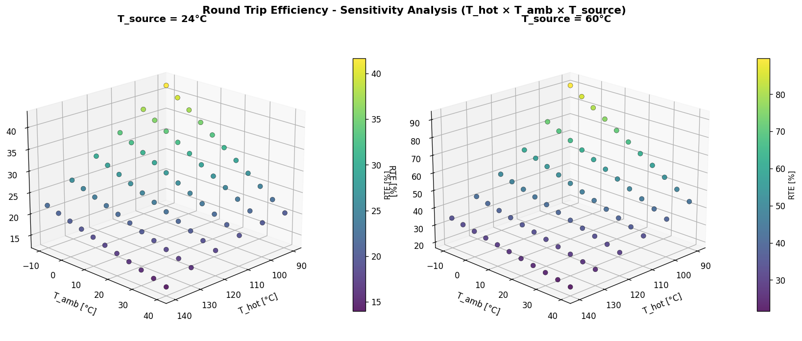
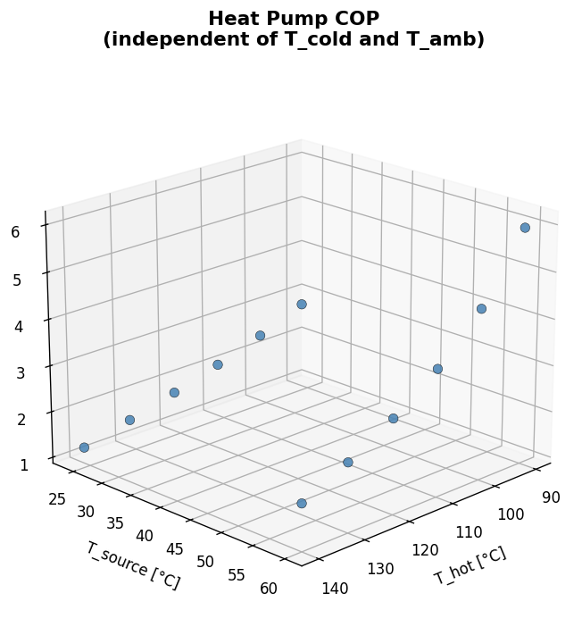
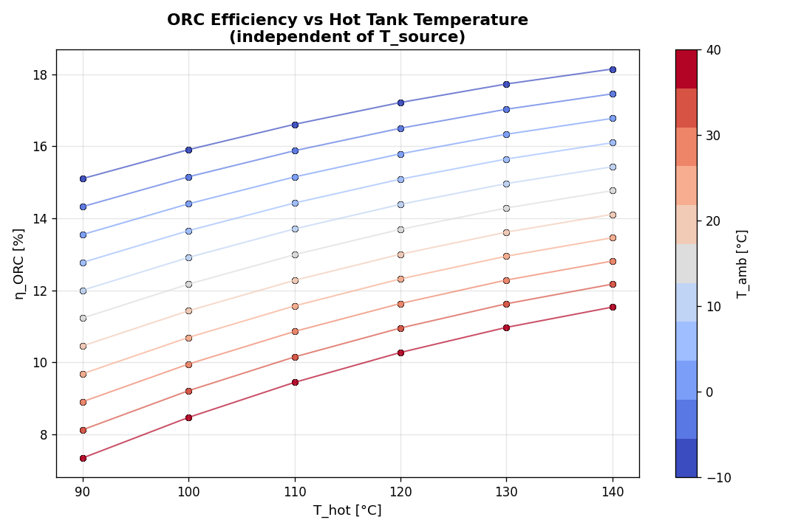
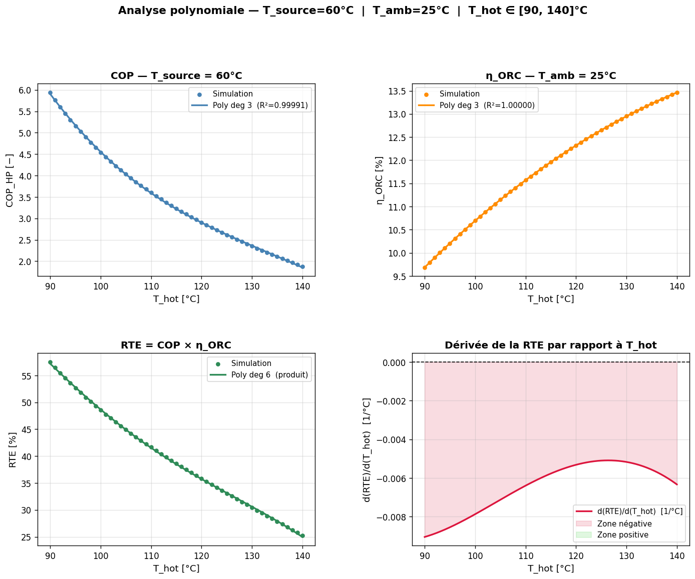

# Carnot Battery — Thermal Storage Simulation

This repo simulates a pumped-thermal energy storage (PTES) system ("Carnot Battery"). It models a heat pump (charging), two water tanks (hot and cold storage), and an ORC (discharging). The main output is the Round-Trip Efficiency (RTE):

**RTE = COP_HP × Eta_ORC**

## Table of Contents
- [What's New](#whats-new)
- [Quick Start](#quick-start)
- [Results & Discussion](#results--discussion)
- [Files](#files)

## What's New
- Ambient sweep: **-10 °C to 40 °C** (5 °C steps)
- Both T_source = 24 °C and 60 °C use identical grids
- Invalid points are preserved and marked (gray crosses in plots)

## Quick Start

Install dependencies and run the full factorial sweep:

```powershell
pip install -r requirements.txt
python carnot_battery.py
```

Output files:
- `sensitivity_results.xlsx` — all data points with pressure ratios
- `3D_sensitivity.png` — visualization (see below)

## Results & Discussion

The 4D sensitivity analysis explores how RTE varies with operating temperatures. The figure below shows results for two source temperatures:

Below are the main figures generated by the analysis. Each plot is saved in the repository so you can inspect or reuse them.

**1) 4D Sensitivity Analysis (RTE vs T_hot, T_amb, T_cold)**



**2) Heat Pump COP (depends on T_hot and T_source)**



**3) ORC Efficiency (depends on T_hot, T_cold, T_amb)**



### Key Physical Relationships

| Parameter | Effect on RTE | Physical Interpretation |
|-----------|---------------|-------------------------|
| **T_hot ↑** | RTE ↓ | Higher hot tank temperature increases HP compression ratio (more work input) but reduces ORC pressure ratio (less power output). The net effect is negative. |
| **T_cold ↑** | RTE ↑ | Higher cold tank temperature relaxes the preheater pinch constraint, allowing higher ORC evaporator pressure → better turbine expansion → higher efficiency. |
| **T_amb ↓** | RTE ↑ | Lower ambient temperature reduces HP evaporator pressure (worse COP) but dramatically improves ORC condenser pressure (much better expansion ratio). The ORC benefit dominates. |
| **T_source ↑** | RTE ↑ | Higher source temperature improves HP evaporator pressure → better COP. The discharge side (ORC) is unaffected by source temperature. |

### Operating Point Trade-offs

- **Best RTE** occurs at: **T_hot = 90 °C, T_cold = 60 °C, T_amb = -10 °C, T_source = 60 °C** → achieving up to **~90% RTE**
- **Worst performance** at high T_hot (150 °C) with low T_cold (20 °C) and warm ambient (40 °C) → RTE drops below **20%**
- **Invalid points** (gray crosses): occur when T_cold ≤ T_amb or T_source ≤ T_amb (thermodynamically impossible heat flows)

The color gradient (blue → red = T_cold 20-60 °C) reveals that **T_cold is critical** for ORC performance: low cold tank temperatures severely constrain the preheater, forcing lower evaporator pressures and killing efficiency.

### Practical Takeaway

For real-world PTES design: prioritize **low T_hot** (reduces storage cost and HP work), **high T_cold** (maximizes ORC output), and operation during **cold ambient conditions** (winter). Higher source temperatures help but have less impact than sink conditions.

## Files

- `carnot_battery.py` — simulation and full factorial sweep
- `requirements.txt` — dependencies (CoolProp, pandas, matplotlib, tqdm)
- `README.md` — this file

## Polynomial regression analysis (T_source=60°C, T_amb=25°C)

This repository includes a polynomial regression analysis performed on the
simulation outputs for the interval `T_hot ∈ [90, 140] °C`.

- Analysis script: `polynomial_analysis.py` produced the figure
	`polynomial_analysis.png`.
- Purpose: fit smooth polynomials to the intensive results and compute
	analytically the derivative d(RTE)/d(T_hot) from the polynomial product.

Figure (saved in the repo):



Fitted polynomial (x = T_hot − 115 °C):

COP_HP(x) = -2.009e-05 x^3 + 1.056e-03 x^2 - 6.847e-02 x + 3.22

η_ORC(x) =  8.356e-09 x^3 - 6.153e-06 x^2 + 7.504e-04 x + 0.1196

RTE(x) = COP_HP(x) × η_ORC(x)

En dérivant analytiquement le produit, le script montre que :

d(RTE)/d(T_hot) < 0 pour tout `T_hot ∈ [90, 140] °C` (valeurs numériques trouvées
entre −0.0091 et −0.0051 1/°C sur cet intervalle).

Interprétation synthétique : l'augmentation de `T_hot` dégrade significativement
le COP de la pompe à chaleur (augmentation du taux de compression), alors que
le gain en efficacité de l'ORC est faible — le produit donc décroît.

